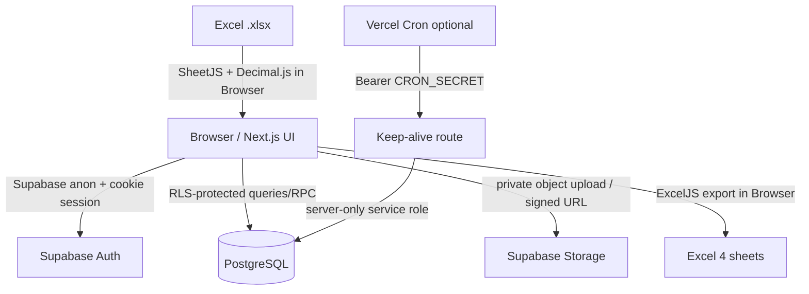

# Revenue Dashboard

ระบบสรุปรายได้รายเดือนและรายได้สะสมสำหรับผู้ใช้ Owner หนึ่งคน พัฒนาด้วย Next.js App Router, Supabase และ browser-side Excel processing โดยทุก Import เป็น immutable version และ Dashboard อ่านเฉพาะ Active Dataset ของแต่ละปี

## หน้าจอหลัก

- `/login` — Email/Password ผ่าน Supabase Auth ไม่มี public sign-up
- `/dashboard` — KPI, แนวโน้มรายเดือน, รายได้ตามหน่วยงาน/กลุ่มบริการ และรายการติดลบ
- `/explorer` — drill-down หน่วยงาน → ส่วนงาน → กลุ่มธุรกิจ → กลุ่มบริการ → รายบริการ
- `/upload` — drag/drop `.xlsx`, parse/validate ใน Browser, preview, chunk insert และ publish
- `/imports` — ประวัติ immutable versions, download source, republish และลบ unpublished batch
- `/backup` — Full Backup ZIP (`JSON`, `JSONL`, manifest)

## Architecture



Active dataset model:

```text
import_batches (immutable version)
  └─ revenue_import_rows

active_datasets(owner_id, report_year)
  └─ active_batch_id → version currently used by Dashboard
```

การ Publish เวอร์ชันใหม่ไม่ต่อ cumulative files เข้าด้วยกัน แต่เปลี่ยน pointer แบบ transaction; เวอร์ชันเดิมเป็น `superseded` และ republish ได้

## Tech stack

- Next.js 16 App Router, React 19, TypeScript strict, Tailwind CSS 4, shadcn/ui Base UI
- Supabase Auth, PostgreSQL, RLS, private Storage
- TanStack Query/Table, Recharts
- SheetJS, ExcelJS, Decimal.js, JSZip
- React Hook Form, Zod
- Vitest, Testing Library, Playwright, ESLint, Prettier

## Prerequisites

- Node.js 22 LTS
- pnpm 11.7+
- Supabase CLI (สำหรับ local database/migrations)
- Git และบัญชี GitHub/Vercel/Supabase

## Local setup

```bash
git clone <YOUR_PRIVATE_REPOSITORY_URL>
cd revenue-dashboard
corepack enable
corepack prepare pnpm@11.7.0 --activate
pnpm install --frozen-lockfile
cp .env.example .env.local
```

Windows PowerShell:

```powershell
Copy-Item .env.example .env.local
```

กรอก `.env.local`:

```bash
NEXT_PUBLIC_SUPABASE_URL=https://YOUR_PROJECT.supabase.co
NEXT_PUBLIC_SUPABASE_ANON_KEY=YOUR_ANON_KEY
SUPABASE_SERVICE_ROLE_KEY=
CRON_SECRET=
NEXT_PUBLIC_APP_NAME=Revenue Dashboard
NEXT_PUBLIC_MAX_UPLOAD_MB=10
```

`SUPABASE_SERVICE_ROLE_KEY` และ `CRON_SECRET` จำเป็นเฉพาะ optional keep-alive route และห้ามมี prefix `NEXT_PUBLIC_`

รันแอป:

```bash
pnpm dev
```

เปิด `http://localhost:3000`

## Supabase setup

### 1. สร้าง project และ link CLI

```bash
supabase login
supabase link --project-ref YOUR_PROJECT_REF
supabase db push
```

Migration จะสร้าง extensions, tables, indexes, triggers, RLS policies, private bucket `source-files`, security-invoker view และ RPC ทั้งหมด อัปเดต TypeScript types เมื่อ schema เปลี่ยนด้วย:

```bash
supabase gen types typescript --linked > lib/supabase/database.types.ts
```

### 2. Owner user และ Auth

1. Supabase Dashboard → Authentication → Users → Add user
2. สร้าง Owner ด้วย Email/Password
3. Authentication → Providers → Email → ปิด “Allow new users to sign up”
4. URL Configuration:
   - Site URL local: `http://localhost:3000`
   - Redirect URL local: `http://localhost:3000/**`
   - Production: `https://YOUR_PROJECT.vercel.app/**`

### 3. Storage

Migration `0005_storage_policies.sql` สร้าง bucket `source-files` แบบ private จำกัด `.xlsx` 10 MB และ path:

```text
{owner_id}/{report_year}/{batch_id}/{sanitized_filename}
```

ห้ามเปลี่ยน bucket เป็น public การดาวน์โหลดใช้ signed URL อายุ 60 วินาที

### 4. Local Supabase (ทางเลือก)

```bash
supabase start
supabase db reset
```

ค่าจาก `supabase status` สามารถใส่ใน `.env.local` เพื่อทดสอบ local stack

## Excel import workflow

1. Browser ตรวจ extension, MIME, size และคำนวณ SHA-256
2. โหลด SheetJS แบบ dynamic และค้นหา `Report_รายเดือน` แบบ normalized/case-insensitive
3. Scan 30 แถวแรกเพื่อหา Header; ตรวจเดือน `YYYYMM` ต่อเนื่องจากมกราคม
4. เก็บเฉพาะแถวที่มี dimensions ครบ 7 ช่อง และตัด Total/Subtotal/หมายเหตุ
5. Decimal.js ปัด `ROUND_HALF_UP` 2 ตำแหน่ง; blank และ zero แยกกัน
6. Preview validation/errors/warnings; error ปิดการบันทึก
7. สร้าง batch `uploading`, upload source private, insert 500 rows/chunk พร้อม retry 3 ครั้ง
8. ตรวจ inserted count แล้วเปลี่ยนเป็น `validated`
9. `publish_import_batch` เปลี่ยน Active Dataset แบบ transaction

Original `.xlsx` ไม่ถูกส่งไป parse ผ่าน Vercel Function; file parsing และ export เกิดใน Browser

## Sample workbook acceptance

วางไฟล์จริงชื่อดังนี้ที่ project root ระดับเดียวกับ `req.md`:

```text
./revenue_report_202605.xlsx
```

ห้ามย้าย เปลี่ยนชื่อ แก้ไข หรือใส่ใน `public/` ไฟล์นี้ถูก ignore ด้วย `/revenue_report_202605.xlsx` และไม่อยู่ใน CI

```bash
pnpm test:sample
git check-ignore revenue_report_202605.xlsx
```

Script ใช้ parser/validator production ชุดเดียวกับหน้า Upload และตรวจทุกค่าตาม Acceptance 30.2

## Tests and quality

```bash
pnpm format:check
pnpm lint
pnpm typecheck
pnpm test
pnpm test:sample
pnpm build
```

E2E ที่ต้องใช้ Supabase จริงแยกจาก default CI:

```bash
E2E_OWNER_EMAIL=owner@example.com \
E2E_OWNER_PASSWORD='your-password' \
pnpm test:e2e
```

บน PowerShell:

```powershell
$env:E2E_OWNER_EMAIL='owner@example.com'
$env:E2E_OWNER_PASSWORD='your-password'
pnpm test:e2e
```

Database pgTAP checks อยู่ใน `supabase/tests/database.sql`

## Export และ Backup

Excel export โหลด ExcelJS เมื่อกดปุ่มและ fetch ครั้งละไม่เกิน 1,000 rows มี 4 sheets:

1. `สรุป`
2. `รายเดือน`
3. `รายละเอียด` (blank source cell ยังคงว่าง)
4. `เงื่อนไขรายงาน`

Full Backup สร้าง ZIP ใน Browser:

- `import_batches.json`
- `active_datasets.json`
- `revenue_import_rows.jsonl`
- `manifest.json`

Restore อัตโนมัติไม่อยู่ใน MVP วิธีปลอดภัยที่สุดคือเก็บ source `.xlsx` และนำเข้าใหม่ตามลำดับ สำหรับ maintenance restore จาก JSON/JSONL ให้ใช้ staging project, ตรวจ owner IDs/row counts/constraints แล้วสลับ project หลัง reconciliation เท่านั้น

## Deploy to Vercel

1. Push โค้ดขึ้น GitHub **Private Repository**
2. Vercel → Add New Project → Import repository
3. Framework preset: Next.js; Install: `pnpm install --frozen-lockfile`; Build: `pnpm build`
4. เพิ่ม environment variables แยก Preview/Production
5. Supabase Auth เพิ่ม Vercel Preview/Production URLs ใน Redirect URLs
6. Deploy แล้วทดสอบ login, upload, publish, dashboard, signed download และ export

Vercel เชื่อม GitHub โดยตรง; GitHub Actions ใช้ตรวจ quality เท่านั้น Preview Deploy มาจาก PR branch และ Production Deploy มาจาก `main`

### Optional Vercel Cron

`vercel.json` เรียก `/api/cron/keep-alive` วันละครั้ง Route ตรวจ `Authorization: Bearer <CRON_SECRET>` และใช้ service role เฉพาะ server หากไม่ต้องการ ให้ลบ `crons` จาก `vercel.json` และไม่ตั้งสอง secrets นี้ ระบบหลักยังทำงานปกติ

ตรวจข้อจำกัดและโควตา Free/Hobby ล่าสุดของผู้ให้บริการก่อนเปิด cron เพราะแผนอาจเปลี่ยนได้

## Security notes

- Protected routes ตรวจ session ที่ proxy และ recheck ใน Server Component/Database RLS
- RLS ใช้ `(select auth.uid())`, owner indexes และ ownership checks ใน `security definer` RPC
- `SUPABASE_SERVICE_ROLE_KEY` import ได้เฉพาะ `server-only` module
- Authenticated pages ส่ง `Cache-Control: private, no-store`
- CSP, `nosniff`, `DENY`, Referrer/Permissions Policy อยู่ใน `next.config.ts`
- Sort/group fields whitelist; filters ใช้ JSONB extraction ไม่มี user-built dynamic SQL
- Original file อยู่ private bucket; signed URL 60 วินาที
- `.env*`, source workbook, Playwright artifacts และ local temp ถูก ignore

## Free-tier considerations

- Parse/export/ZIP ทำใน Browser ลด serverless execution และ egress
- Dashboard ใช้ RPC aggregation/indexes ไม่ download fact rows ทั้งหมด
- Dimension options cache ต่อปี; stale queries ถูก abort เมื่อ URL filters เปลี่ยน
- Import insert ตาม chunk; source preview จำกัดจำนวนแถว
- Version retention ใช้พื้นที่เพิ่มตามจำนวน Import ควร export backup และตรวจ Storage/Database usage เป็นระยะ

## Troubleshooting

- **Redirect กลับ `/login` ตลอด:** ตรวจ Site URL/Redirect URL, anon key และ cookie domain
- **`TARGET_SHEET_MISSING`:** ชีทต้อง normalize เป็น `Report_รายเดือน`
- **เดือนขาดช่วง:** ต้องเริ่ม `YYYY01` และต่อเนื่องถึงงวดล่าสุด
- **บันทึกบาง chunk:** batch ยังไม่ publish ตรวจ Import detail/failure message แล้วนำเข้าใหม่
- **ไฟล์ซ้ำ:** hash เดิมถูก block ให้เปิด Import เดิม
- **Storage 403:** ตรวจ migration/policies และ path folder แรกต้องเป็น `auth.uid()`
- **Dashboard ว่าง:** ต้องมี batch status `published` และ `active_datasets` ของปีนั้น
- **Cron 401:** header ต้องตรง `CRON_SECRET`; อย่าใส่ secret ใน query string
- **Build เตือน Node engine:** ใช้ Node 22 ตาม `.nvmrc`/`package.json`

Checklist แบบย่ออยู่ที่ [`docs/deploy-checklist.md`](docs/deploy-checklist.md)
