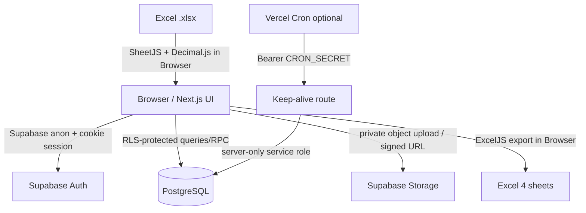

# Revenue Dashboard

ระบบสรุปรายได้รายเดือนและรายได้สะสมสำหรับผู้ใช้ Owner หนึ่งคน พัฒนาด้วย Next.js App Router, Supabase และ browser-side Excel processing โดยทุก Import เป็น immutable version และ Dashboard อ่านเฉพาะ Active Dataset ของแต่ละปี

## Domain model สำหรับรายงาน — ลำดับชั้นส่วนงาน

รายงานใหม่ทุกหน้าต้องใช้ลำดับชั้นพื้นที่จากระดับบนลงล่างดังนี้:

```text
กลุ่มระดับภาค
└── ฝ่าย
    └── ส่วนงานระดับจังหวัด
```

| ระดับ   | ความหมาย                                                    | แหล่งข้อมูล/วิธีหา                  |
| ------- | ----------------------------------------------------------- | ----------------------------------- |
| กลุ่ม   | ส่วนงานระดับภาค ประกอบจากผลรวมของฝ่ายที่กำหนดไว้ในกลุ่ม     | คำนวณจาก Mapping กลุ่ม–ฝ่ายด้านล่าง |
| ฝ่าย    | หน่วยงานที่อยู่ภายใต้กลุ่ม และประกอบด้วยส่วนงานระดับจังหวัด | ฐานข้อมูลคอลัมน์ `unit_name`        |
| ส่วนงาน | หน่วยงานระดับจังหวัดที่อยู่ภายใต้ฝ่าย                       | ฐานข้อมูลคอลัมน์ `section_name`     |

### Mapping กลุ่มระดับภาคกับฝ่าย

| รหัสกลุ่ม | ชื่อกลุ่ม             | ฝ่ายภายใต้กลุ่ม | กติกาการรวมข้อมูล         |
| --------- | --------------------- | --------------- | ------------------------- |
| `นป.`     | ภาคเหนือ              | `นป.1`, `นป.2`  | ข้อมูลของ `นป.1` + `นป.2` |
| `ตป.`     | ภาคตะวันออกเฉียงเหนือ | `ตป.1`, `ตป.2`  | ข้อมูลของ `ตป.1` + `ตป.2` |
| `อป.`     | ภาคตะวันออก           | `อป.1`, `อป.2`  | ข้อมูลของ `อป.1` + `อป.2` |

คำว่า **กลุ่ม** ในลำดับชั้นนี้หมายถึง **กลุ่มระดับภาค/กลุ่มส่วนงาน** ไม่ใช่ `business_group` หรือ “กลุ่มธุรกิจ” ซึ่งเป็นคนละมิติข้อมูล

ความสัมพันธ์ระหว่างฝ่ายกับส่วนงานต้องยึดข้อมูลจริงในฐานข้อมูลเป็น Source of Truth ห้ามอนุมานจากชื่อจังหวัดหรือข้อความใน `section_name` ตัวอย่าง:

```text
อป. (ภาคตะวันออก)
└── อป.2
    └── ส่วนขายและบริการลูกค้า ระยอง
```

ดังนั้น `ส่วนขายและบริการลูกค้า ระยอง` อยู่ภายใต้ฝ่าย `อป.2` และกลุ่ม `อป.` หรือ “ภาคตะวันออก” ตาม `unit_name` และ `section_name` ในฐานข้อมูล

กติกาสำหรับรายงาน:

1. ยอดส่วนงานรวมจากรายการรายได้ที่มี `section_name` ตรงกัน ภายใต้ช่วงเวลาและตัวกรองที่เลือก
2. ยอดฝ่ายรวมจากส่วนงานทั้งหมดที่มี `unit_name` ตรงกับฝ่ายนั้น
3. ยอดกลุ่มรวมจากฝ่ายตาม Mapping ด้านบน
4. ยอดกลุ่มต้องเท่ากับทั้งผลรวมของฝ่าย และผลรวมของส่วนงานภายใต้ฝ่ายเหล่านั้น
5. รายงาน ตัวกรอง Drill-down และไฟล์ Export ต้องใช้ลำดับ `กลุ่ม → ฝ่าย → ส่วนงาน` และ Mapping เดียวกัน
6. การเปรียบเทียบระหว่างปีต้องจับคู่หน่วยงานระดับเดียวกัน รวมถึงบริการและส่วนงานเดียวกัน
7. ฝ่ายที่ไม่มี Mapping หรือส่วนงานที่ไม่มีฝ่ายต้องแสดงเป็น “ยังไม่จัดกลุ่ม” ห้ามคาดเดาความสัมพันธ์

## หน้าจอหลัก

- `/login` — Email/Password ผ่าน Supabase Auth ไม่มี public sign-up
- `/dashboard` — KPI, แนวโน้มรายเดือน, รายได้ตามหน่วยงาน/กลุ่มบริการ และรายการติดลบ
- `/explorer` — drill-down หน่วยงาน → ส่วนงาน → กลุ่มธุรกิจ → กลุ่มบริการ → รายบริการ
- `/upload` — drag/drop `.xlsx`, parse/validate ใน Browser, preview, chunk insert และ publish
- `/imports` — ประวัติ immutable versions, download source, republish และลบ unpublished batch
- `/backup` — Full Backup ZIP (`JSON`, `JSONL`, manifest)

- `/organization-overview` — ภาพรวมสายงาน ป. แยกกลุ่ม ฝ่าย และส่วนงาน
- `/op-service-overview` — ภาพรวม อป. รายบริการ เทียบรายได้ปีก่อน เป้าหมายทั้งปี และเป้าหมายตามสัดส่วนเดือน
- `/op-area-overview` — ภาพรวม อป. รายพื้นที่ แยกกลุ่ม อป., ฝ่าย อป.1–อป.2 และ 11 ส่วนงาน
- `/broadband-revenue` — รายได้ Internet Retail (Broadband) เฉพาะพื้นที่ อป.
- `/datacom-revenue` — รายได้ Datacom เฉพาะพื้นที่ อป.
- `/fixed-line-revenue` — รายได้ Fixed Line เฉพาะพื้นที่ อป.
- `/mobile-retail-revenue` — รายได้ Mobile Retail เฉพาะพื้นที่ อป.
- `/ict-solution-revenue` — รายได้กลุ่มธุรกิจ ICT-Solution เฉพาะพื้นที่ อป.
- `/digital-revenue` — รายได้กลุ่มธุรกิจ Digital เฉพาะพื้นที่ อป.
- `/asset-development-revenue` — รายได้กลุ่มบริการพัฒนาสินทรัพย์ เฉพาะพื้นที่ อป.
- `/e-office-revenue` — รายได้บริการ e-Office เฉพาะพื้นที่ อป.
- `/revenue-targets` — ตั้งเป้าหมายรายได้รายปีเฉพาะหน่วยงาน/บริการที่ต้องการ เลือกกรอกได้ทั้งหน่วยล้านบาทหรือบาท โดยฐานข้อมูลเก็บเป็นบาท (Owner เท่านั้น)

## Architecture



Active dataset model:

```text
import_batches (immutable version)
  └─ revenue_import_rows

active_datasets(owner_id, report_year)
  └─ active_batch_id → version currently used by Dashboard
```

การ Publish เวอร์ชันใหม่ไม่ต่อ cumulative files เข้าด้วยกัน แต่เปลี่ยน pointer แบบ transaction; เวอร์ชันเดิมเป็น `superseded` และ republish ได้

## เป้าหมายรายได้รายปี

เป้าหมายรายได้เป็นข้อมูลแบบเลือกกำหนด (sparse): ระบบสร้างแถวใน revenue_targets เฉพาะขอบเขตที่ Owner ตั้งเป้าหมายจริงเท่านั้น การไม่มีแถวหมายถึง **ยังไม่ได้ตั้งเป้าหมาย** ไม่ใช่เป้าหมายศูนย์ และการลบรายการคือการยกเลิกเป้าหมายของขอบเขตนั้น

ขอบเขตหนึ่งรายการประกอบด้วย:

- ปี ค.ศ. ในฐานข้อมูล และแสดง พ.ศ. ในหน้าจอ
- ระดับส่วนงานหนึ่งระดับ: group, unit หรือ section
- ขอบเขตบริการหนึ่งระดับ: ทุกบริการ, business_group, service_group หรือ service
- เป้าหมายทั้งปี หน้าจอให้ผู้ใช้เลือกกรอกเป็นล้านบาทหรือบาท แปลงด้วย Decimal.js และเก็บเป็น numeric(20,2) หน่วยบาท

ตัวอย่างที่รองรับ:

- อป. × กลุ่มธุรกิจ Digital × พ.ศ. 2569 = 26.36 ล้านบาท
- ส่วนขายและบริการลูกค้า ระยอง (ภายใต้ อป.2) × ทุกบริการ × พ.ศ. 2569 = 357.12 ล้านบาท

เป้าหมายต่างระดับเป็นอิสระต่อกัน ระบบไม่รวมเป้าหมายกลุ่ม ฝ่าย และส่วนงานโดยอัตโนมัติ เพราะอาจเป็นขอบเขตซ้อนกันและทำให้ยอดเป้าหมายถูกนับซ้ำ รายงานในอนาคตต้องจับคู่รายได้จริงกับขอบเขตของเป้าหมายรายการเดียวกัน แล้วคำนวณ:

> % ความสำเร็จ = รายได้สะสมจริง ÷ เป้าหมายทั้งปี × 100

หากปีเป้าหมายยังไม่มี Active Dataset ระบบคงเป้าหมายไว้และแสดงว่า “ยังไม่มีข้อมูลจริง” โดยไม่แปลงเป็นรายได้ศูนย์ ตัวเลือกหน่วยงาน/บริการใช้งานจาก Active Dataset ของปีเป้าหมาย หรือชุดข้อมูลล่าสุดเมื่อเป็นการตั้งเป้าหมายล่วงหน้า

## ภาพรวม อป. รายบริการ

หน้า `/op-service-overview` แสดงรายได้สะสมของ `อป. — ภาคตะวันออก` โดยรวมฝ่ายผ่าน Mapping `organization_group_units` และเปรียบเทียบ 4 ค่าในหน่วยล้านบาท:

- รายได้สะสมปีที่เลือก
- รายได้ช่วงเดียวกันของปีก่อน
- เป้าหมายทั้งปีจาก `revenue_targets`
- เป้าหมายที่ควรทำได้ถึงเดือนล่าสุด = เป้าหมายทั้งปี × จำนวนเดือน ÷ 12

รายการหลักประกอบด้วย Hard Infrastructure, International, Mobile, Fixed Line & Broadband, Digital และ ICT Solution พร้อมรายละเอียดเฉพาะกลุ่มบริการที่กำหนดใน `req.md` หัวข้อ 37 ยอดรวมจะนับเฉพาะแถวกลุ่มธุรกิจเพื่อไม่บวกแถวรายละเอียดซ้ำ และรายการที่ยังไม่มีเป้าหมายจะแสดงเป็น “ยังไม่ตั้งเป้าหมาย” แทนศูนย์

ตารางบนหน้าสามารถ Export เป็น Excel ได้ใน Browser ด้วย ExcelJS โดยไฟล์ใช้ช่วงเวลา ลำดับรายการ สูตรเป้าหมายตามเดือน และยอดรวมเดียวกับหน้าจอ

## ภาพรวม อป. รายพื้นที่

หน้า `/op-area-overview` ใช้รูปแบบการเปรียบเทียบเดียวกับรายงานรายบริการ แต่แบ่งตามโครงสร้างพื้นที่จริงในฐานข้อมูลเป็น `อป. → อป.1/อป.2 → ส่วนงาน` กราฟแยกเป็นภาพรวมกลุ่ม, ฝ่าย อป.1, ฝ่าย อป.2 และส่วนงานทั้งหมด พร้อมแสดงตัวเลขบนแท่งกราฟ

ตารางเรียง 5 ส่วนงานของ อป.1 ตามด้วยยอดรวมฝ่าย, 6 ส่วนงานของ อป.2 ตามด้วยยอดรวมฝ่าย และยอดรวม อป. เป้าหมายทุกบริการอ่านจาก `revenue_targets` ของระดับนั้นโดยตรงและไม่รวมข้ามระดับ รายการที่ไม่มีเป้าหมายคงเป็นค่าว่าง ไฟล์ Excel ใช้ลำดับและตัวเลขเดียวกับหน้าจอ

## รายได้ตามบริการและกลุ่มธุรกิจเฉพาะพื้นที่ อป.

รายงาน Broadband, Datacom, Fixed Line, Mobile Retail, ICT-Solution, Digital, พัฒนาสินทรัพย์ และ e-Office ใช้โครงสร้างเดียวกับรายงานรายได้ Broadband โดยจำกัดรายได้และเป้าหมายไว้ที่ `อป. — ภาคตะวันออก` ผ่าน Mapping `organization_group_units` เท่านั้น แต่ละหน้ามี KPI กราฟแนวตั้ง 4 ส่วน ตารางเต็มหน้าจอ 16:9 และ Excel export แยกสีตามรายงาน

รายงานระดับกลุ่มบริการจับคู่ทั้ง `business_group + service_group` รายงาน Digital และ ICT-Solution จับคู่ที่ระดับ `business_group` ส่วน e-Office จับคู่ `business_group + service_group + service_name` ครบทั้งสามมิติ เป้าหมายอ่านจากระดับองค์กรเดียวกับแต่ละแถวโดยตรง ไม่มีการบวกเป้าหมายส่วนงานขึ้นเป็นเป้าหมายฝ่ายหรือกลุ่ม และรายการที่ไม่ได้ตั้งเป้าหมายยังคงเป็น `null` ไม่ใช่ศูนย์ โดยกราฟจะละเว้นแท่งเป้าหมายของระดับนั้น

## Tech stack

- Next.js 16 App Router, React 19, TypeScript strict, Tailwind CSS 4, shadcn/ui Base UI
- Supabase Auth, PostgreSQL, RLS, private Storage
- TanStack Query/Table, Recharts
- SheetJS, ExcelJS, Decimal.js, JSZip
- React Hook Form, Zod
- Vitest, Testing Library, Playwright, ESLint, Prettier

## Prerequisites

- Node.js 22 LTS
- pnpm 11.7+
- Supabase CLI (สำหรับ local database/migrations)
- Git และบัญชี GitHub/Vercel/Supabase

## Local setup

```bash
git clone <YOUR_PRIVATE_REPOSITORY_URL>
cd revenue-dashboard
corepack enable
corepack prepare pnpm@11.7.0 --activate
pnpm install --frozen-lockfile
cp .env.example .env.local
```

Windows PowerShell:

```powershell
Copy-Item .env.example .env.local
```

กรอก `.env.local`:

```bash
NEXT_PUBLIC_SUPABASE_URL=https://YOUR_PROJECT.supabase.co
NEXT_PUBLIC_SUPABASE_ANON_KEY=YOUR_ANON_KEY
SUPABASE_SERVICE_ROLE_KEY=
CRON_SECRET=
NEXT_PUBLIC_APP_NAME=Revenue Dashboard
NEXT_PUBLIC_MAX_UPLOAD_MB=10
```

`SUPABASE_SERVICE_ROLE_KEY` และ `CRON_SECRET` จำเป็นเฉพาะ optional keep-alive route และห้ามมี prefix `NEXT_PUBLIC_`

รันแอป:

```bash
pnpm dev
```

เปิด `http://localhost:3000`

## Supabase setup

### 1. สร้าง project และ link CLI

```bash
supabase login
supabase link --project-ref YOUR_PROJECT_REF
supabase db push
```

Migration จะสร้าง extensions, tables, indexes, triggers, RLS policies, private bucket `source-files`, security-invoker view และ RPC ทั้งหมด อัปเดต TypeScript types เมื่อ schema เปลี่ยนด้วย:

```bash
supabase gen types typescript --linked > lib/supabase/database.types.ts
```

### 2. Owner user และ Auth

1. Supabase Dashboard → Authentication → Users → Add user
2. สร้าง Owner ด้วย Email/Password
3. Authentication → Providers → Email → ปิด “Allow new users to sign up”
4. URL Configuration:
   - Site URL local: `http://localhost:3000`
   - Redirect URL local: `http://localhost:3000/**`
   - Production: `https://YOUR_PROJECT.vercel.app/**`

### 3. Storage

Migration `0005_storage_policies.sql` สร้าง bucket `source-files` แบบ private จำกัด `.xlsx` 10 MB และ path:

```text
{owner_id}/{report_year}/{batch_id}/{sanitized_filename}
```

ห้ามเปลี่ยน bucket เป็น public การดาวน์โหลดใช้ signed URL อายุ 60 วินาที

### 4. Local Supabase (ทางเลือก)

```bash
supabase start
supabase db reset
```

ค่าจาก `supabase status` สามารถใส่ใน `.env.local` เพื่อทดสอบ local stack

## Excel import workflow

1. Browser ตรวจ extension, MIME, size และคำนวณ SHA-256
2. โหลด SheetJS แบบ dynamic และค้นหา `Report_รายเดือน` แบบ normalized/case-insensitive
3. Scan 30 แถวแรกเพื่อหา Header; ตรวจเดือน `YYYYMM` ต่อเนื่องจากมกราคม
4. เก็บเฉพาะแถวที่มี dimensions ครบ 7 ช่อง และตัด Total/Subtotal/หมายเหตุ
5. Decimal.js ปัด `ROUND_HALF_UP` 2 ตำแหน่ง; blank และ zero แยกกัน
6. Preview validation/errors/warnings; error ปิดการบันทึก
7. สร้าง batch `uploading`, upload source private, insert 500 rows/chunk พร้อม retry 3 ครั้ง
8. ตรวจ inserted count แล้วเปลี่ยนเป็น `validated`
9. `publish_import_batch` เปลี่ยน Active Dataset แบบ transaction

Original `.xlsx` ไม่ถูกส่งไป parse ผ่าน Vercel Function; file parsing และ export เกิดใน Browser

## Sample workbook acceptance

วางไฟล์จริงชื่อดังนี้ที่ project root ระดับเดียวกับ `req.md`:

```text
./revenue_report_202605.xlsx
```

ห้ามย้าย เปลี่ยนชื่อ แก้ไข หรือใส่ใน `public/` ไฟล์นี้ถูก ignore ด้วย `/revenue_report_202605.xlsx` และไม่อยู่ใน CI

```bash
pnpm test:sample
git check-ignore revenue_report_202605.xlsx
```

Script ใช้ parser/validator production ชุดเดียวกับหน้า Upload และตรวจทุกค่าตาม Acceptance 30.2

## Tests and quality

```bash
pnpm format:check
pnpm lint
pnpm typecheck
pnpm test
pnpm test:sample
pnpm build
```

E2E ที่ต้องใช้ Supabase จริงแยกจาก default CI:

```bash
E2E_OWNER_EMAIL=owner@example.com \
E2E_OWNER_PASSWORD='your-password' \
pnpm test:e2e
```

บน PowerShell:

```powershell
$env:E2E_OWNER_EMAIL='owner@example.com'
$env:E2E_OWNER_PASSWORD='your-password'
pnpm test:e2e
```

Database pgTAP checks อยู่ใน `supabase/tests/database.sql`

## Export และ Backup

Excel export โหลด ExcelJS เมื่อกดปุ่มและ fetch ครั้งละไม่เกิน 1,000 rows มี 4 sheets:

1. `สรุป`
2. `รายเดือน`
3. `รายละเอียด` (blank source cell ยังคงว่าง)
4. `เงื่อนไขรายงาน`

Full Backup สร้าง ZIP ใน Browser:

- `import_batches.json`
- `active_datasets.json`
- `revenue_import_rows.jsonl`
- `manifest.json`

Restore อัตโนมัติไม่อยู่ใน MVP วิธีปลอดภัยที่สุดคือเก็บ source `.xlsx` และนำเข้าใหม่ตามลำดับ สำหรับ maintenance restore จาก JSON/JSONL ให้ใช้ staging project, ตรวจ owner IDs/row counts/constraints แล้วสลับ project หลัง reconciliation เท่านั้น

## Deploy to Vercel

1. Push โค้ดขึ้น GitHub **Private Repository**
2. Vercel → Add New Project → Import repository
3. Framework preset: Next.js; Install: `pnpm install --frozen-lockfile`; Build: `pnpm build`
4. เพิ่ม environment variables แยก Preview/Production
5. Supabase Auth เพิ่ม Vercel Preview/Production URLs ใน Redirect URLs
6. Deploy แล้วทดสอบ login, upload, publish, dashboard, signed download และ export

Vercel เชื่อม GitHub โดยตรง; GitHub Actions ใช้ตรวจ quality เท่านั้น Preview Deploy มาจาก PR branch และ Production Deploy มาจาก `main`

### Optional Vercel Cron

`vercel.json` เรียก `/api/cron/keep-alive` วันละครั้ง Route ตรวจ `Authorization: Bearer <CRON_SECRET>` และใช้ service role เฉพาะ server หากไม่ต้องการ ให้ลบ `crons` จาก `vercel.json` และไม่ตั้งสอง secrets นี้ ระบบหลักยังทำงานปกติ

ตรวจข้อจำกัดและโควตา Free/Hobby ล่าสุดของผู้ให้บริการก่อนเปิด cron เพราะแผนอาจเปลี่ยนได้

## Security notes

- Protected routes ตรวจ session ที่ proxy และ recheck ใน Server Component/Database RLS
- RLS ใช้ `(select auth.uid())`, owner indexes และ ownership checks ใน `security definer` RPC
- `SUPABASE_SERVICE_ROLE_KEY` import ได้เฉพาะ `server-only` module
- Authenticated pages ส่ง `Cache-Control: private, no-store`
- CSP, `nosniff`, `DENY`, Referrer/Permissions Policy อยู่ใน `next.config.ts`
- Sort/group fields whitelist; filters ใช้ JSONB extraction ไม่มี user-built dynamic SQL
- Original file อยู่ private bucket; signed URL 60 วินาที
- `.env*`, source workbook, Playwright artifacts และ local temp ถูก ignore

## Free-tier considerations

- Parse/export/ZIP ทำใน Browser ลด serverless execution และ egress
- Dashboard ใช้ RPC aggregation/indexes ไม่ download fact rows ทั้งหมด
- Dimension options cache ต่อปี; stale queries ถูก abort เมื่อ URL filters เปลี่ยน
- Import insert ตาม chunk; source preview จำกัดจำนวนแถว
- Version retention ใช้พื้นที่เพิ่มตามจำนวน Import ควร export backup และตรวจ Storage/Database usage เป็นระยะ

## Troubleshooting

- **Redirect กลับ `/login` ตลอด:** ตรวจ Site URL/Redirect URL, anon key และ cookie domain
- **`TARGET_SHEET_MISSING`:** ชีทต้อง normalize เป็น `Report_รายเดือน`
- **เดือนขาดช่วง:** ต้องเริ่ม `YYYY01` และต่อเนื่องถึงงวดล่าสุด
- **บันทึกบาง chunk:** batch ยังไม่ publish ตรวจ Import detail/failure message แล้วนำเข้าใหม่
- **ไฟล์ซ้ำ:** hash เดิมถูก block ให้เปิด Import เดิม
- **Storage 403:** ตรวจ migration/policies และ path folder แรกต้องเป็น `auth.uid()`
- **Dashboard ว่าง:** ต้องมี batch status `published` และ `active_datasets` ของปีนั้น
- **Cron 401:** header ต้องตรง `CRON_SECRET`; อย่าใส่ secret ใน query string
- **Build เตือน Node engine:** ใช้ Node 22 ตาม `.nvmrc`/`package.json`

Checklist แบบย่ออยู่ที่ [`docs/deploy-checklist.md`](docs/deploy-checklist.md)
